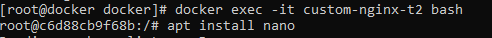
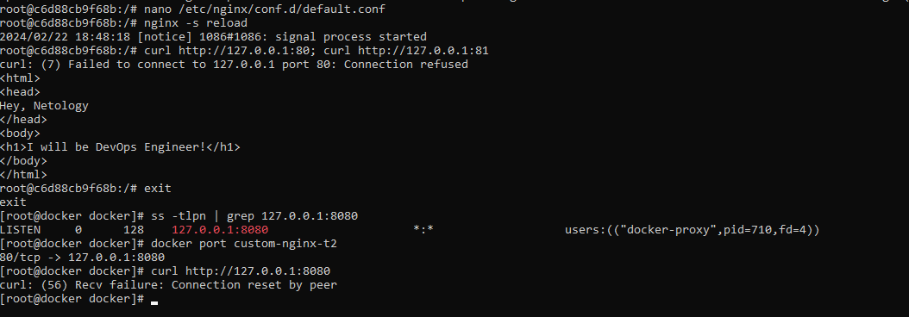
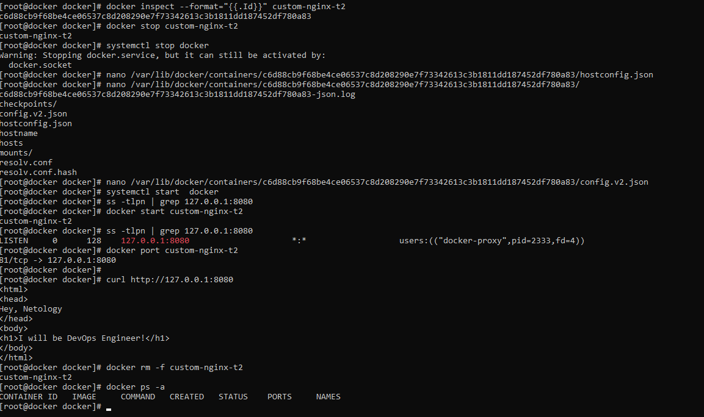
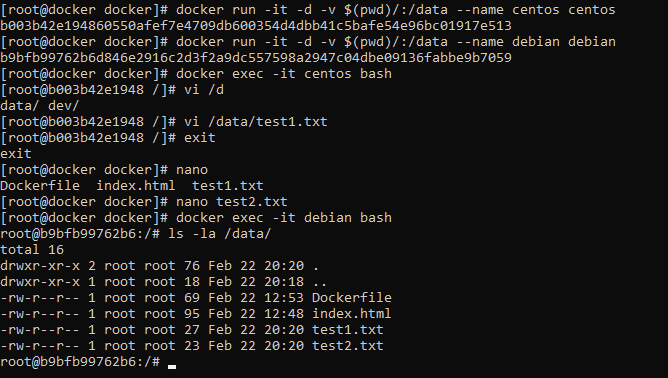

1. https://hub.docker.com/repository/docker/aspire87/custom-nginx/general

2.  Запуск  контейнера с параметрами. Переименование контейнера без  его остановки. Проверка работы контейнера :

    

3. Присоединение к контейнеру c помощью  docker attach <container_id>
    

    При использовании  команды docker attach <container_id> мы связываем стандартный ввод, вывод или потоки ошибок контейнера с  оболочкой хоста. При использовании  комбинации  клавиш CTRL-c сеанс хоста  передает контейнеру сигнал  SIGINT , и завершает его основной процесс,  поэтому контейнер  и останавливается

    Присоединение в интерактивном режиме c docker exec -it <container_id> bash

    

    Вывод  команд в контейнере и на хосте

     

    Проблема заключается в том,  что  изначально  мы пробрасывали 127.0.0.1:8080 порт  хоста на порт 80 nginx  в контейнере.  После смены  порта на 81 и мягкого перезапуска  nginx,  процесс веб-сервера в контейнере теперь ожидает подключения на 81  порту, вместо  80. Поэтому попытки соединения с хостовой  ВМ неуспешны. Для того, чтобы страница была доступна с хостовой ОС (извне) необходимо  изменить  биндинг  портов с 127.0.0.1:8080 -> 80 на 127.0.0.1:8080 -> 81

    Решение проблемы с биндингом портов хоста и контейнера без удаления контейнера и повторного изменения конфигуарции nginx
    
    

4. Работа с  docker  volume

     