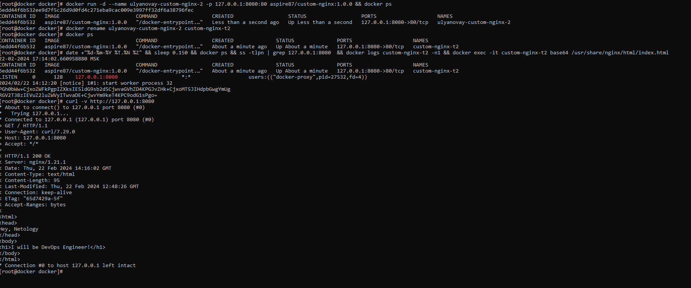
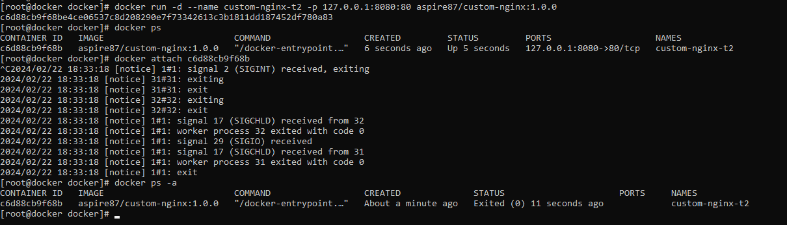

1. https://hub.docker.com/repository/docker/aspire87/custom-nginx/general

2.  Запуск  контейнера с параметрами. Переименование контейнера без  его остановки. Проверка работы контейнера :

    

3. Присоединение к контейнеру 
    

    При использовании  команды docker attach <container_id> мы связываем стандартный ввод, вывод или потоки ошибок контейнера с  оболочкой хоста. При использовании  комбинации  клавиш CTRL-c сеанс хоста  передает контейнеру сигнал  SIGINT , и завершает его основной процесс,  поэтому контейнер  и останавливается

